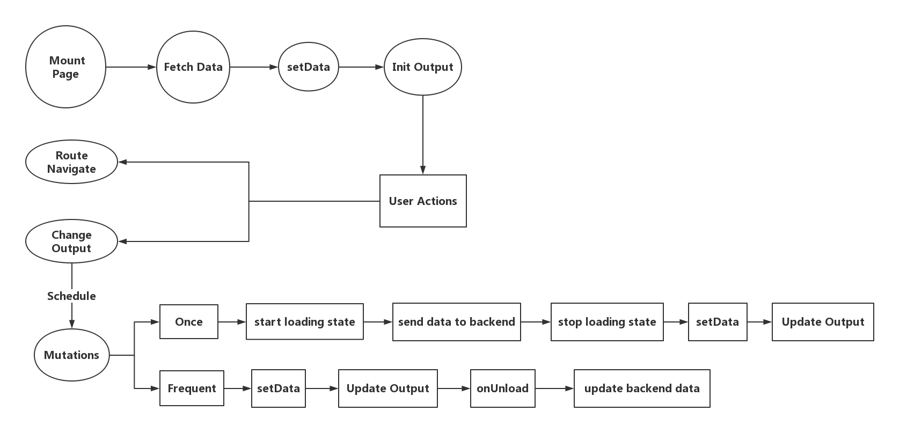
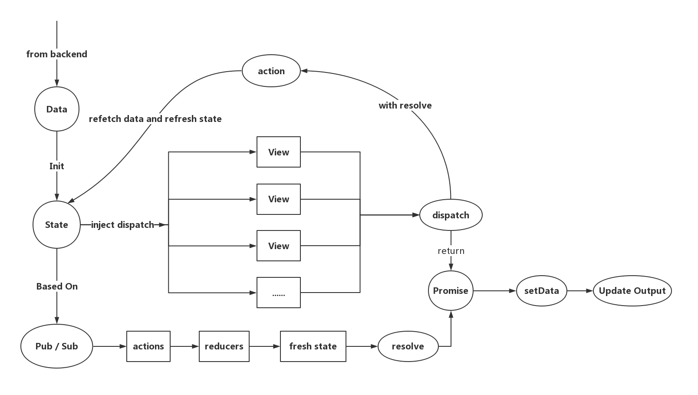

**comment 与 post 组件完善**

* 点赞、收藏功能与交互效果
* 渐变图片预览效果 ( PhotoSwipe )
* 回复评论

**圈子页、圈子详情页、热门页、我的收藏页、我的点赞页、我发布的圈话页、置顶详情页** 

* 圈话懒加载（将数据分批传入视图层，避免一次性 setData 数据过大）
* 循环渲染中指定 key 值
* 图片懒加载 Intersection Observer
* 图片预加载 ( 提前获取图片尺寸 )  

**个人信息页**

* 头像修改
* 昵称修改

**发布圈话页**

* 图片上传 ( 限制 PNG 与 JPG )
* 图片预览 ( PhotoSwipe )

**Data Fetching ( Suspense )**

* 动态请求
* 加载状态
* 错误处理
* 竞态处理

**其他**

* 分包加载
* 全局状态管理 ( state ) 
* 跨页面通信 ( event bus )

